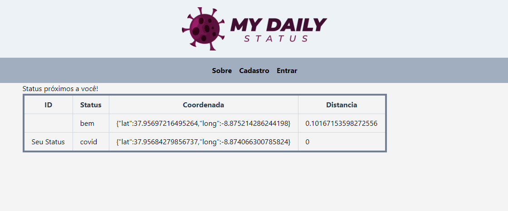
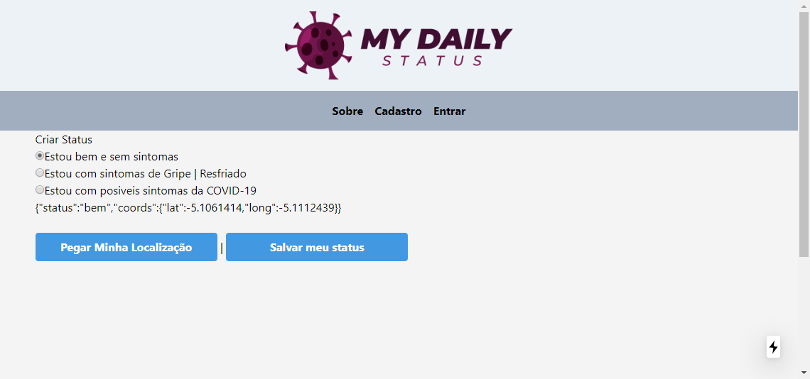

<h4 align="center">
    
</h4>
<p>&nbsp;</p>

<h4 align="center"> 
  🚀 Aplicação desenvolvida durante a semana Fullstack-Lab do DevPleno 🚀
</h4>

<p align="center">
  	
  
	
  <a href="https://www.linkedin.com/in/eliaspjuk/">
    
  </a>
  
  <a href="https://github.com/EliasJuk/MyDailyStatus/commits/master">
    
  </a>
  
  <a href="https://github.com/EliasJuk/MyDailyStatus/issues">
    
  </a>
  
   
<p>

<p align="center">
  <a href="#rocket-Technologies">Technologies</a>&nbsp;&nbsp;&nbsp;|&nbsp;&nbsp;&nbsp;
  <a href="#-layout">Layout</a>&nbsp;&nbsp;&nbsp;|&nbsp;&nbsp;&nbsp;
  <a href="#memo-license">License</a>
</p>

---

<p>&nbsp;</p>

## :rocket: Technologies

This project was developed with the following technologies:


- [React](https://reactjs.org)
- [Next.js](https://nextjs.org/)
- [Node.js](https://nodejs.org/en/)
- [Tailwindcss](https://tailwindcss.com/)
- [Auth0](https://auth0.com/)
- [Dotenv](https://www.npmjs.com/package/dotenv)
- [Firebase](https://firebase.google.com/)
- [Geofirestore](https://github.com/geofirestore/geofirestore-js/)
- [Axios](https://github.com/axios/axios)

### 💫 Futuras Implementações 

### 📍 MAP 

- [Google-Map-React](https://github.com/google-map-react/google-map-react)
- [Jsbin](https://jsbin.com/ruwogapuke/1/edit?js,output)


---

## 🔖 Layout

Para acessar o layout utilize a ferramenta [Figma](https://www.figma.com/file/1rKLCBdbCGTE3mJFBc2VsJ/MyDailyStatus).


<p>Futuramente será implementado um mapa e uma timeline para mostrar todos os chekins e suas respectivas datas de postagem</p>

#### Cheking status diario

<h4 align="center">
    
</h4>

#### Cheking proximos ao seu

<h4 align="center">
    
</h4>


---


## ❔ How To Use

#### 🔒 Auth0
<p>Antes de tudo você precisa se cadastrar no Auth0 para criar uma chave de autentificação para a api de login, após criar a conta, com a chave em mãos você deve criar um arquivo .env você pode usar como exemplo o arquivo .env-exemple, nele você devera substituir as informações CLIENT_ID, CLIENT_SECRETE e DOMAIN pelas informações obtidas no painel de APIs</p> 

#### 🔥 Firebase
- Cadastrar-se no firebase
- Ir para o console
- Adicionar projeto e nomear como **MyDailyStatus**
- Localize as configurações de projeto
- Clique na aba contas de serviço e em gerar nova chave privada
- Salve a chave na basta no projeto
- Renomear o arquivo de credenciais para **firebase-secret.json**

### 💫 Startando o Projeto

#### Development Environment
```bash
# run dev
$ npm run dev
```


#### Production Environment
```bash
# build
$ npm run build

# start
$ npm run start
```

---


## ❔ How to contribute

- Make a fork;
- Create a branck with your feature: `git checkout -b my-feature`;
- Commit changes: `git commit -m 'feat: My new feature'`;
- Make a push to your branch: `git push origin my-feature`.

After merging your receipt request to done, you can delete a branch from yours.

---

### Help's

<p>Function to calculate distance between two coordinates</p>

- [stackoverflow](https://stackoverflow.com/questions/18883601/function-to-calculate-distance-between-two-coordinates)

---

## :memo: License

This project is under the MIT license. See the [LICENSE](LICENSE.md) for details.
